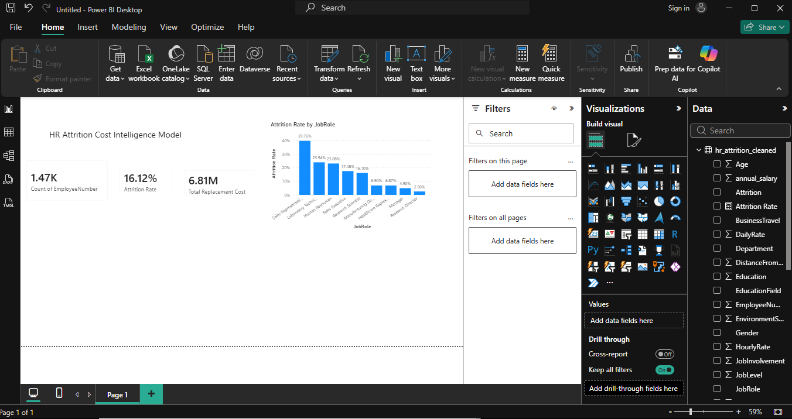

# HR Attrition Cost Intelligence Model

## Business Problem
This company loses **16.1% of its workforce annually** (237 of 1,470 employees), 
costing an estimated **$6.8M to $20.4M per year** in replacement costs, depending 
on role seniority. Attrition is not evenly distributed — it is heavily concentrated 
in a single role, suggesting a targeted, addressable problem rather than a 
company-wide crisis.

## Key Findings

- **Sales Representatives are the highest-risk role by far**, with a **39.8% 
  attrition rate** — 16x higher than Research Directors (2.5%) and 8x higher 
  than Managers (4.9%).
- **Overtime is strongly linked to attrition.** Employees working overtime leave 
  at **30.5%**, nearly 3x the rate of those who don't (10.4%).
- **Overtime alone doesn't explain the pattern.** Overtime rates are nearly 
  identical across all departments (27–29%), ruling out department as a hidden 
  cause — the overtime-attrition link appears to be a genuine, direct relationship.
- **Two distinct attrition patterns exist, requiring different responses:**
  - *Early-career burnout*: Sales Representatives who leave average just 
    **2.1 years of tenure** — shorter than those who stay (3.5 years) — 
    consistent with high-pressure, high-overtime entry-level roles.
  - *Rare senior departures*: Managers and Research Directors who leave have 
    *longer* tenure than those who stay (15.6 and 26.5 years vs. 14.4 and 10.5) 
    — likely driven by retirement or external offers, not burnout.

## Cost Model Methodology
Replacement cost is estimated as a percentage of each departed employee's 
annual salary (MonthlyIncome × 12), a standard HR industry approach. Three 
scenarios are presented rather than a single figure, since replacement cost 
varies significantly by role seniority:

| Assumption | Estimated Annual Cost |
|---|---|
| 50% of salary (conservative) | $6,807,246 |
| 100% of salary (industry midpoint) | $13,614,492 |
| 150% of salary (senior/specialized roles) | $20,421,738 |

## Dashboard

## Tools & Methods

| Tool | Purpose |
|---|---|
| **Python (pandas)** | Data inspection, cost modeling, tenure/segment analysis |
| **SQL (SQLite)** | Business-question queries, cost calculations with CASE WHEN |
| **Power BI (DAX)** | Interactive dashboard with live-recalculating measures |

## Data Cleaning Notes
- Removed 3 columns with zero variation across all 1,470 employees 
  (`EmployeeCount`, `StandardHours`, `Over18`) — confirmed via `.unique()` 
  before dropping.
- No missing values found across any of the 35 original columns.
- Rating-scale columns (Education, JobSatisfaction, WorkLifeBalance, etc.) are 
  correctly stored as integers (e.g., WorkLifeBalance: 1=Bad, 4=Best) — retained 
  as-is, since averaging these values is valid, but requires scale context when 
  interpreting results.

## Project Structure
data/           Raw and cleaned datasets
notebooks/      Python analysis scripts
sql/            SQLite database and finalized queries
powerbi/        Power BI dashboard file (.pbix)
images/         Dashboard screenshots

## Dataset
[IBM HR Analytics Employee Attrition & Performance](https://www.kaggle.com/datasets/pavansubhasht/ibm-hr-analytics-attrition-dataset) 
(Kaggle) — 1,470 employees, 35 features.